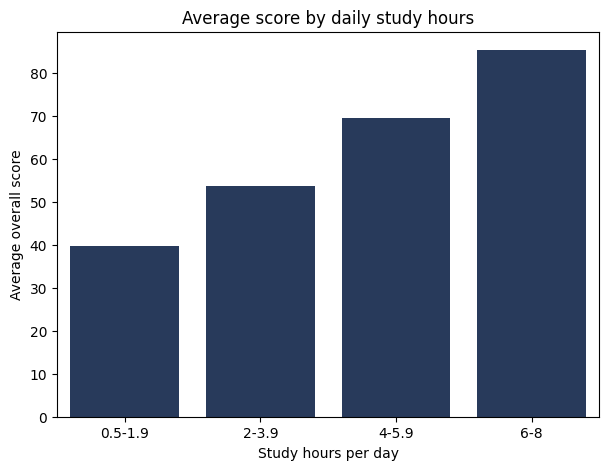
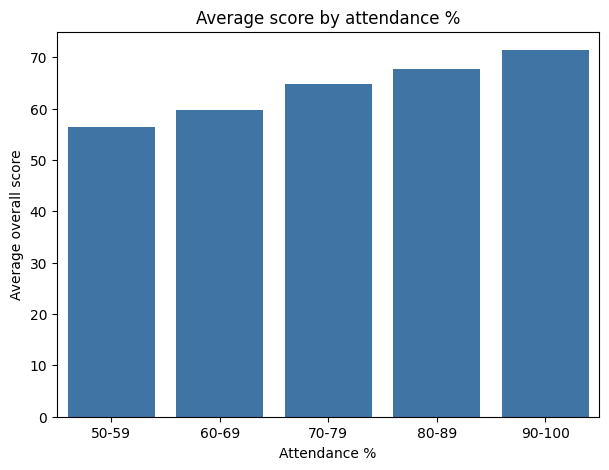

# Student Performance Analysis (Python + SQL)

## Objective
Find which factors are linked to student exam performance, using Python, SQL and data visualisation.

## Dataset
Public dataset from Kaggle: "Student Performance Dataset" (kundanbedmutha).
25,000 rows and 16 columns: demographics, study habits, subject scores and final grade.
The data appears to be synthetic, so findings describe this dataset only, not real schools.

## Tools
Python, Pandas, SQLite, SQL, Matplotlib, Seaborn, Google Colab

## Steps
1. Loaded the data and checked missing values, duplicates, ranges and label consistency.
2. Found and removed 10,000 duplicate rows, leaving 15,000 unique students.
3. Loaded the cleaned data into an SQLite database.
4. Wrote SQL queries (GROUP BY, CASE WHEN, WHERE, ORDER BY, LIMIT) to compare average scores across groups.
5. Created charts to show the main patterns.

## Key Findings
- **Study hours:** the strongest factor. Average score rose from 39.8 (under 2 hours/day) to 85.4 (6-8 hours/day).
- **Attendance:** average score rose from 56.4 (50-59%) to 71.4 (90-100%).
- **Low attendance, high scores:** the top 10 scorers with attendance under 60% all studied 7.7-8.0 hours a day.
- **No meaningful difference** by study method, internet access, school type, parent education,
  travel time, extra activities or gender (all within about 1-1.5 points).

## Limitations
- Results show association, not cause.
- The data looks synthetic, so patterns may not match real students.

# Charts

### Average score by daily study hours

### Average score by attendance

